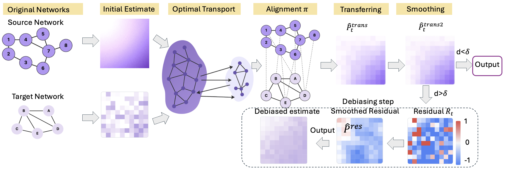

# Transfer Learning on Edge Connecting Probability Estimation Under Graphon Model (NeurIPS'25)

---

## Overview

**GTRANS** is a novel transfer learning framework for estimating edge connection probabilities under the **graphon model**, specifically designed for **small-sample graphs**. We propose a method that leverages a **large source graph** via **Gromov-Wasserstein Optimal Transport**, with an **adaptive debiasing mechanism** to avoid negative transfer.

Graphon models offer a nonparametric foundation for modeling large random graphs, but estimation accuracy suffers in small graphs. GTRANS transfers structural information from larger graphs to improve estimation in the small target graph, achieving state-of-the-art performance in both simulation and real-world tasks such as **link prediction** and **graph classification**.

---

TO BE CONTINUED.
